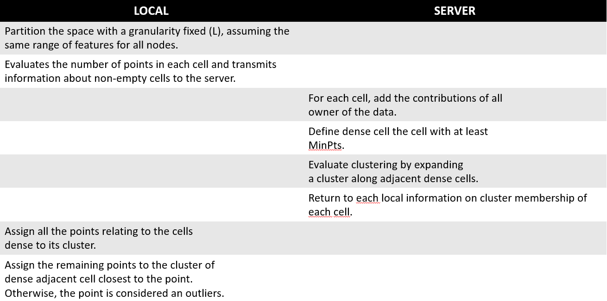

# DMML_FederatedDBSCAN
This repository contains a project that implements the DBScan clustering algorithm in a federated way. The goal of this project is to enable distributed clustering of data across multiple devices or nodes in a decentralized network, while preserving the privacy of the individual data points. The implementation is based on the original DBScan algorithm, but has been adapted to work in a federated setting.

Please, check the [Presentation](Project_Presentation.pdf) for a complete view. 

## A couple of words on Federated learning 
Federated Learning is a distributed machine learning technique where multiple devices or nodes (such as smartphones or IoT devices) work together to improve a shared model, without sharing raw data. Each device trains a local model using its own data, and then sends updates to a central server that aggregates the updates to improve the shared global model. This allows for the benefits of large-scale data collection and training without compromising data privacy or security. It is used in scenarios where data is distributed across multiple devices and it is not possible or desirable to collect it in a central location.

## A couple of words on DBSCAN
DBSCAN (Density-Based Spatial Clustering of Applications with Noise) is a density-based clustering algorithm that groups together points in a dataset that are close to each other based on a distance metric epsilon (ε) and a density threshold, called minimum number of points (MinPts).

Steps:
1. The algorithm starts with an arbitrary point in the dataset, and retrieves all points within a distance of ε from that point. If the number of points is greater than or equal to MinPts, a new cluster is formed with these points.

2. The algorithm then retrieves all unvisited points that are within a distance of ε from the points in the cluster, and adds them to the cluster as well. This process continues until no more points can be added to the cluster.

3. The algorithm then selects a new unvisited point and repeats the process to form the next cluster. This continues until all points in the dataset have been visited.

4. Points that are not part of any cluster are considered as noise.

DBSCAN algorithm does not require to specify the number of clusters in advance, it finds them based on the density of the data. It allows for the discovery of clusters of arbitrary shape and is particularly well-suited for datasets with varying densities. However, the choice of ε and MinPts can greatly affect the resulting clusters, and finding good values for these parameters can be challenging.

 

## Steps of the Algorithm
Our Adaptation of the algorithm for Federated Learning setting consists in the following steps: 

## Benchmarking
The algorithm was tested with various parameter settings and against different data sets. Its performance was then compared with that of a standard DBSCAN. No substantial difference emerged from this comparison, so almost no performance losses.
